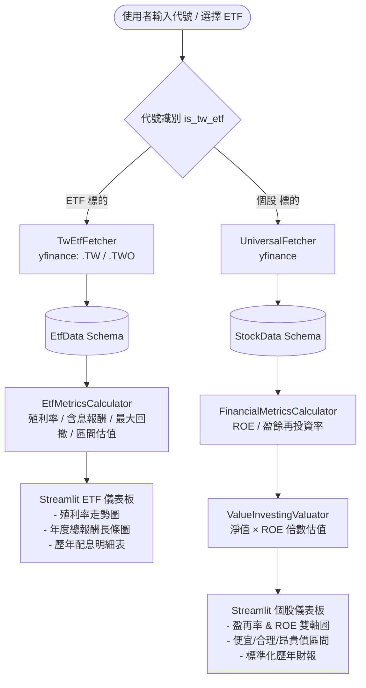

# 📈 Python 盈餘再投資率與台股 ETF 價值評估系統
### Earnings Reinvestment Table & Taiwan ETF Value Analysis Dashboard

[](https://www.python.org/)
[](https://streamlit.io/)
[](https://plotly.com/)
[](https://opensource.org/licenses/MIT)

基於**巴菲特（Warren Buffett）**與[洪瑞泰（Michael Hong）巴菲特班](https://stocks.ddns.net/Intro.aspx)價值投資哲學的自動化開源分析工具。系統提供**個股盈再表分析**以及**台灣股市 ETF 殖利率與含息報酬率評估**雙核心引擎，搭配 Streamlit 打造即時互動式儀表板。

---

## 🌟 核心特色

### 1. 🏢 個股盈再表分析（台股 / 美股）
- **盈餘再投資率（Reinvestment Rate）**：
  $$\text{盈再率} = \frac{(\text{當期固定資產} + \text{長期投資}) - (4年前固定資產 + 4年前長期投資)}{\text{近4年淨利總和}} \times 100\%$$
  - 安全標準：$< 40\%$ 為優質不燒錢企業；$> 80\%$ 須高度警戒。
  - 已加入分母接近零的保護與資料完整度標記。
- **股東權益報酬率（ROE）**：檢視歷年 ROE 趨勢與近 5 年平均表現（門檻：$> 15\%$）。
- **內在價值估值模型**：優先使用**每股淨值 × (平均 ROE / 15%)** 計算合理價，再推導便宜價（0.8x）與昂貴價（1.3x）。若無淨值資料則 fallback 至舊邏輯並明確標示。
- **視覺化趨勢**：Plotly 雙軸互動圖表，標示 15% ROE 與 40% 盈再率安全警戒線。
- **資料品質提示**：自動判斷財報完整度（ok / partial / insufficient）並在 UI 警示。

### 2. 📊 台灣股市 ETF 專屬分析引擎
針對 ETF 無傳統財務報表之特質，打造專屬評估模型：
- **智慧代號識別**：自動判斷輸入標的為個股或 ETF（如 `0050`, `0056`, `00878`, `006208`, `00679B` 等）。
- **熱門 ETF 分類快選**：內建市值型、高股息、科技產業、海外股票、債券型等快速選單。
- **殖利率與配息分析**：
  - 計算近 12 個月追蹤殖利率（TTM Yield）與歷年平均殖利率。
  - 統計連續配息次數與殖利率變異係數（CV 穩定度）。
- **殖利率常態分佈區間估值**：
  - 🟢 **便宜區間**：殖利率高於歷史均值 $+1\sigma$
  - 🟡 **合理區間**：殖利率座落於歷史均值附近
  - 🔴 **昂貴區間**：殖利率低於歷史均值 $-1\sigma$
- **含息總報酬率回測**：1 年、3 年（年化）、5 年（年化）含息總報酬率與歷史最大回撤（Max Drawdown）。
  - **修正**：使用原始價格 + 明確現金配息計算，避免 auto_adjust 重複計算問題。
- **完整配息與報酬圖表**：殖利率歷史趨勢圖、年度含息總報酬長條圖、每股現金配息歷程表。

---

## 🏛️ 模組化系統架構

專案遵循**SOLID 原則**與**低耦合設計**，各層職責分明，易於水平擴充新資料源或計量模型：

```
earnings-reinvestment-table/
├── core/
│   ├── interfaces.py           # 抽象介面卡榫 (BaseFetcher, BaseCalculator, BaseValuator, BaseEtfFetcher, BaseEtfAnalyzer)
│   └── schemas.py              # Pydantic 強型別資料結構 (StockData, ValuationResult, EtfData, EtfAnalysisResult)
├── modules/
│   ├── fetchers/
│   │   ├── etf_registry.py     # 台灣 ETF 清單、分類登錄與代號規則識別
│   │   ├── tw_etf_fetcher.py   # 台灣 ETF 價量與配息抓取器 (yfinance, auto_adjust=False)
│   │   └── us_fetcher.py       # 通用個股資料抓取器 (強化多標籤容錯、年份對齊、淨值提取)
│   ├── calculators/
│   │   ├── metrics.py          # 個股 ROE、盈餘再投資率運算模組（含邊界保護）
│   │   └── etf_metrics.py      # ETF 殖利率、含息報酬率、最大回撤運算模組
│   └── valuators/
│       └── valuation.py        # 個股便宜/合理/昂貴價價值評估引擎（優先使用淨值）
├── app.py                      # Streamlit 互動式儀表板主入口（session_state 狀態管理）
├── requirements.txt            # 相依套件清單
└── README.md                   # 專案說明文件
```

### 資料管線流程圖



---

## 🚀 快速開始

### 1. 安裝環境需求
- Python 3.10 或以上版本

### 2. 下載專案並安裝依賴

```bash
# 複製儲存庫
git clone https://github.com/wumoztw/earnings-reinvestment-table.git
cd earnings-reinvestment-table

# 建立並啟動虛擬環境 (建議)
python3 -m venv .venv
source .venv/bin/activate  # Linux / macOS
# .venv\\Scripts\\activate   # Windows

# 安裝相依套件
pip install -r requirements.txt
```

### 3. 啟動 Streamlit 儀表板

```bash
streamlit run app.py
```

瀏覽器將自動開啟 `http://localhost:8501`。

---

## 💡 使用範例

### 個股盈再表分析
1. 在左側側邊欄輸入台股代號（如 `2330`、`2454`）或美股代號（如 `AAPL`、`MSFT`、`NVDA`）。
2. 點擊 **開始分析**。
3. 檢視最新盈再率、近 5 年平均 ROE 以及便宜/合理/昂貴價估值（會顯示計算基礎）。

### 台灣 ETF 分析
1. 輸入 ETF 代號（如 `0050`、`0056`、`00878`、`006208`、`00679B`）或從側邊欄 **ETF 快速選股** 下拉選單選擇。
2. 系統自動切換至 ETF 專屬介面，即時呈現：
   - 近 12 個月殖利率與歷年平均殖利率
   - 1 年 / 3 年 / 5 年含息年化報酬率與最大回撤
   - 殖利率估值區間（推算之便宜/合理/昂貴價）
   - 殖利率趨勢、年度含息報酬率與歷年配息詳細數據

---

## 🛠️ 開發與測試

如需單獨執行模組驗證或單元測試：

```bash
# 驗證 ETF 資料管線
python -c "
from modules.fetchers.tw_etf_fetcher import TwEtfFetcher
from modules.calculators.etf_metrics import EtfMetricsCalculator

etf = TwEtfFetcher().fetch('0050')
res = EtfMetricsCalculator().analyze(etf)
print(f'{etf.name}: 殖利率={res.current_yield}%, 訊號={res.signal}')
"

# 驗證個股資料管線
python -c "
from modules.fetchers.us_fetcher import UniversalFetcher
from modules.calculators.metrics import FinancialMetricsCalculator
from modules.valuators.valuation import ValueInvestingValuator

stock = UniversalFetcher().fetch('2330')
metrics = FinancialMetricsCalculator().calculate_metrics(stock)
val = ValueInvestingValuator().evaluate(stock, metrics)
print(f'{stock.name}: ROE={val.avg_roe}%, 盈再率={val.reinvest_rate}%, 訊號={val.signal}')
print(f'估值方法: {val.base_value_method}, 使用淨值: {val.book_value_used}')
"
```

---

## 🗺️ 未來展望 (Roadmap)

- [ ] 整合 **TWSE / TPEx OpenAPI** 即時折溢價與淨值 (iNAV)
- [ ] 串接 **TDCC 集保股權分散表** 自動計算每週受益人人數與籌碼集中度
- [ ] 支援投信公會 **總費用率 (TER / 內扣費用)** 自動擷取
- [ ] 導入持股成分股穿透分析與重疊度比對

---

## 🔗 相關資源與致敬 (References)

- 🏛️ **[洪瑞泰（Michael Hong）巴菲特班](https://stocks.ddns.net/Intro.aspx)**：巴菲特價值投資法在台灣的先驅推廣者，本系統之盈餘再投資率（盈再率）、ROE 評價標準及內在價值評估核心架構皆啟發自洪瑞泰老師之著作與理論。

---

## 📄 授權條款

本專案採用 [MIT License](LICENSE) 授權開放。歡迎自由 Fork、提交 PR 或 Issue 共同完善！

---

## 📝 近期重要更新 (2026-08)

1. **資料抓取穩健性大幅提升**：UniversalFetcher 支援多組 yfinance 標籤容錯、共同年份對齊、資料品質標記、自動提取每股淨值。
2. **總報酬計算修正**：改用 `auto_adjust=False` + 明確加入現金配息，避免重複計算問題。
3. **估值模型與文件一致**：真正優先使用「每股淨值 × (ROE/15)」邏輯。
4. **盈再率邊界保護**：分母接近零時設為 NaN，避免極端數字。
5. **UX 改善**：session_state 狀態管理、更清晰的錯誤提示與計算基礎顯示。
6. **清理**：移除未使用的重複檔案 `tw_fetcher.py`。
